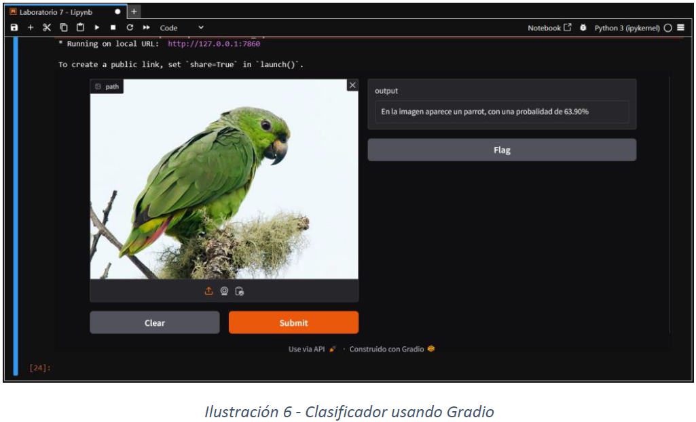

# Laboratorio#6 Aprendizaje Automático en Visión Artificial

Este laboratorio explora técnicas avanzadas de procesamiento visual centradas en la detección y mejora de estructuras relevantes en las imágenes. El objetivo es comprender cómo se pueden preparar y analizar las imágenes para dar soporte a aplicaciones de visión artificial y aprendizaje profundo.

El laboratorio demuestra pasos clave de preprocesamiento utilizados en sistemas de visión artificial reales.

## Objetivos
- Detectar y realzar patrones visuales importantes.
- Aplicar técnicas avanzadas de procesamiento de imágenes.
- Comprender los procesos de preprocesamiento para visión artificial.
- Desarrollar intuición para la extracción de características en aprendizaje profundo.
- Preparar imágenes para análisis basados ​​en IA.

## Conceptos aplicados
- Detección de patrones.
- Mejora de características visuales.
- Preprocesamiento de imágenes.
- Análisis estructural.
- Fundamentos del procesamiento de imágenes.

## El laboratorio demuestra
- Procesar imágenes para resaltar características relevantes.
- Detectar patrones visuales importantes.
- Mejorar estructuras con fines analíticos.
- Preparar imágenes para modelos avanzados de visión artificial.
- Interpretar los resultados visuales procesados.

## Preview

## Resultados del aprendizaje
- La detección de características mejora la interpretabilidad de las imágenes.
- El preprocesamiento es fundamental para el rendimiento del aprendizaje profundo.
- La mejora estructural facilita las tareas de visión basadas en IA.
- Comprender los flujos de trabajo es clave para el diseño de sistemas de visión artificial.

## Autor
Rebeca Mendoza, <b>[LinkedIn](https://www.linkedin.com/in/rebeca-mendoza-240401375/)</b>
